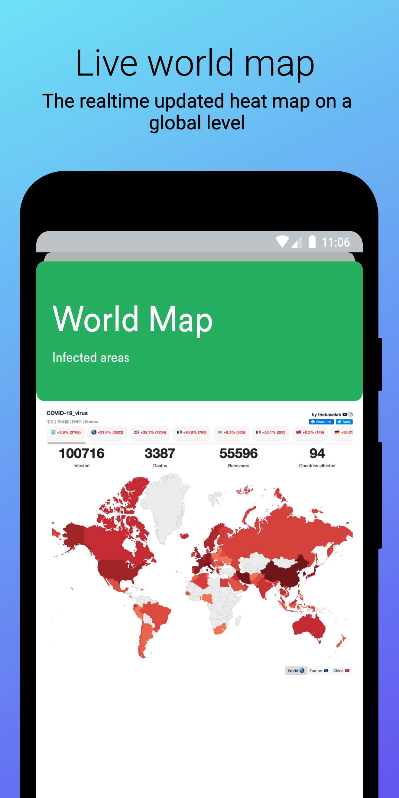
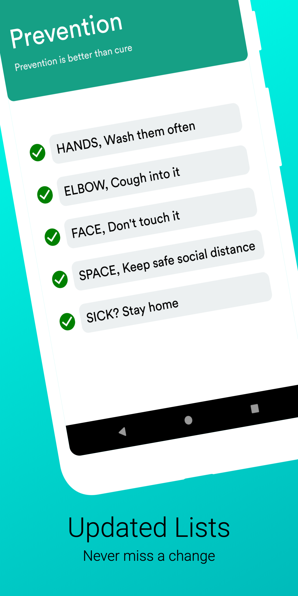

# COVID -19

An essential toolkit to fight COVID-19

## Getting Started

The app is based on React Native (Expo)

### Dependencies

Expo CLI (optional)

```
$ npm install -g expo-cli
```

### Installing

Clone the repo then use

```
$ npm install
```

To start the app use

```
$ npm start
```

## Screenshots





## Downloads
* [Releases](https://github.com/abhishekashyap/covid-19/releases)

## Built With

* [React Native](https://reactnative.dev/) - React Native is an open-source mobile application framework created by Facebook
* [Expo](https://expo.io/) - Expo is a set of tools built around React Native

## Coming soon

* Live list updates
* Live heatmap updates

## Contributing

Currently not accepting any contributions.
<!-- Please read [CONTRIBUTING.md](CONTRIBUTING.md) for details on our code of conduct, and the process for submitting pull requests to us. -->

## Authors

* **Abhishek Kashyap** - *Initial work* - [abhishekashyap](https://github.com/abhishekashyap)

## License

This project is licensed under the MIT License - see the [LICENSE.md](LICENSE.md) file for details
